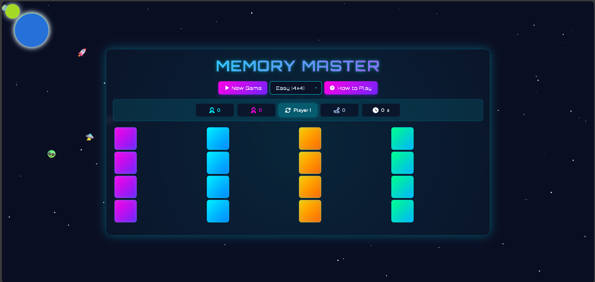

Memory Master - A Space-Themed Memory Match Game
Overview
Memory Master is an engaging, two-player memory match game with a futuristic space theme. Players take turns flipping cards to find matching pairs, with the goal of scoring the most points. The game features a visually appealing interface with animated space elements, sound effects, and multiple difficulty levels.
Features

Two-Player Gameplay: Players alternate turns to find matching pairs, with extra turns awarded for successful matches.
Difficulty Levels: Choose from Easy (4×4), Medium (6×6), Hard (8×8), or Expert (10×10) grid sizes.
Dynamic Emoji Sets: Different emoji sets are used based on difficulty (e.g., space-themed for Easy, math symbols for Hard).
Interactive Animations: Includes card flips, shake effects for mismatches, a confetti celebration for game completion, and a space background with animated stars, planets, and spaceships.
Responsive Design: Optimized for various screen sizes, including mobile devices.
Sound Effects: Audio feedback for card flips, matches, mismatches, and game completion.
Statistics Tracking: Displays player scores, current player, total moves, and elapsed time.
Modals: Includes a "How to Play" guide and a "Mission Complete" modal showing final scores.

Technologies Used

HTML5: Structure of the game.
CSS3: Styling with custom animations, gradients, and responsive design.
JavaScript: Game logic, event handling, and dynamic DOM manipulation.
External Libraries:
Font Awesome for icons.
Google Fonts (Orbitron and Kanit) for typography.

Setup Instructions

Clone or Download:
Clone the repository or download the HTML file containing the game.

Host the File:
Open the index.html file in a web browser, or host it on a local or remote server (e.g., using Live Server in VS Code or a hosting service).

Ensure Internet Access:
The game requires an internet connection to load external resources (Google Fonts, Font Awesome, and sound effects hosted on CodePen).

Play:
Open the game in a modern web browser (Chrome, Firefox, Safari, etc.).
Select a difficulty level from the dropdown menu.
Click "New Game" to start or restart.
Click cards to flip them and find matches.
View the "How to Play" modal for detailed instructions.

How to Play

Objective: Match pairs of cards to score points. The player with the most matches wins.
Gameplay:
Players take turns flipping two cards at a time.
If the cards match, the player scores a point and gets another turn.
If the cards do not match, they flip back, and the next player takes their turn.

Winning: The game ends when all pairs are matched. The player with the higher score wins, or it's a tie if scores are equal.
Controls:
New Game: Starts a new game with the selected difficulty.
Difficulty Dropdown: Choose the grid size (4×4, 6×6, 8×8, or 10×10).
How to Play: Opens a modal with game instructions.
Stats: Displays Player 1 and Player 2 scores, current player, total moves, and time elapsed.

File Structure

index.html: The main file containing HTML, CSS, and JavaScript for the game.
No additional files are required, as all styles and scripts are embedded or loaded via CDNs.

Known Limitations

Sound Effects: Audio files are hosted on CodePen and require an internet connection. If the links become unavailable, sounds may not play.
Performance: Larger grid sizes (e.g., 10×10) may experience slight performance delays on low-end devices due to the number of cards and animations.
Browser Compatibility: Tested on modern browsers. Older browsers may not support all CSS animations or features.

Future Enhancements

Add local sound files to eliminate dependency on external URLs.
Implement single-player mode with AI or timer-based challenges.
Add customizable themes or additional emoji sets.
Include a high-score system with local storage.
Optimize performance for larger grids on low-end devices.

Credits

Developed by [Your Name or Handle].
Sound effects sourced from CodePen.
Icons from Font Awesome.
Fonts from Google Fonts.

License
This project is licensed under the MIT License. Feel free to use, modify, and distribute it as needed.

Preview

